# Stream Dock Audio Control

> **macOS only.** Audio is controlled through AppleScript (`osascript`), and the plugin ships only a macOS build.

A [Mirabox Stream Dock](https://mirabox.net) plugin for macOS with two knob actions for the **N4 Pro**. The panel above each knob always shows the current state.

## What you'll see

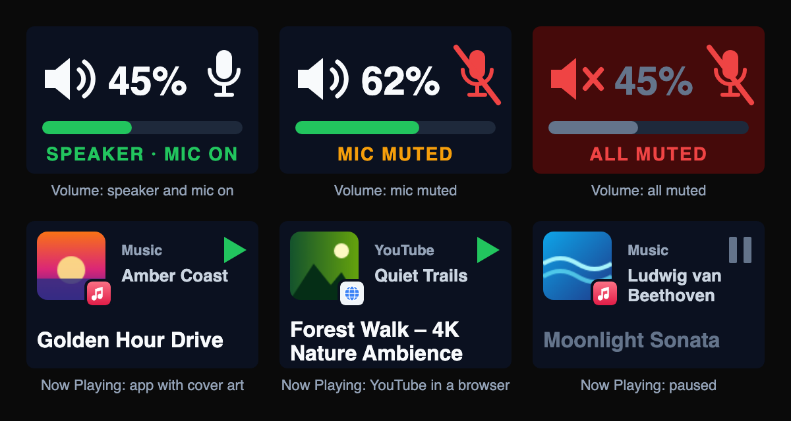

Knob panels (176×112), top row **Volume + Mic Mute**, second row **Now Playing**, then the same actions on a 144×144 key:

<table>
<tr><td align="center">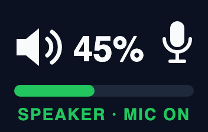<br><sub>Speaker and mic on</sub></td><td align="center">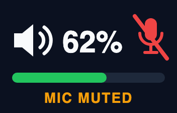<br><sub>Mic muted</sub></td><td align="center">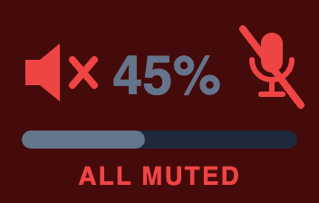<br><sub>All muted (press)</sub></td><td align="center">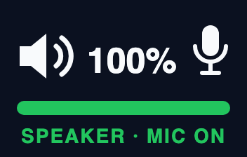<br><sub>100%</sub></td></tr>
<tr><td align="center">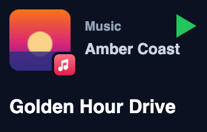<br><sub>App, with cover art and app badge</sub></td><td align="center">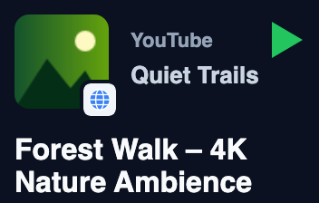<br><sub>Browser: shows the site (YouTube)</sub></td><td align="center">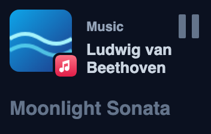<br><sub>Paused</sub></td><td align="center">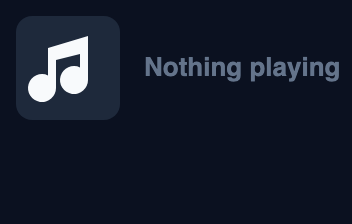<br><sub>Nothing playing</sub></td></tr>
<tr><td align="center">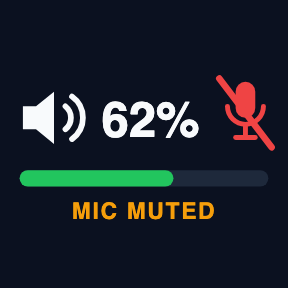<br><sub>Volume on a normal key</sub></td><td align="center">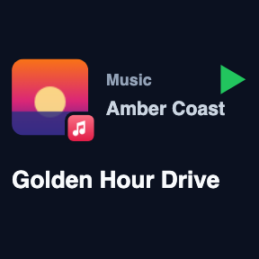<br><sub>Now Playing on a normal key</sub></td></tr>
</table>

## Knob actions

### Volume + Mic Mute

| Input | Effect |
|---|---|
| Turn | Changes output volume by 2% per tick. Reaching 0 mutes the speaker, like the keyboard volume keys; turning up unmutes it. The mic isn't touched. |
| Press | If the speaker or the mic is live, mutes **both**. If both are already muted, turns both back on. |

### Now Playing

| Input | Effect |
|---|---|
| Turn right | Next track (one skip per turn, however fast you spin) |
| Turn left | Previous track |
| Press | Play / pause |

The panel shows the track's cover art (like the macOS Now Playing widget) with the source app as a small badge in its corner. Next to the cover it shows the source name, a play/pause indicator and the artist; the track title (up to two lines) runs underneath. Without cover art, the app icon takes its place. When a browser is playing, the source name is the website (SoundCloud, YouTube, VK Video…, or the bare domain) instead of the browser's name. It works with any app that reports to macOS "Now Playing": Apple Music, Spotify, Yandex Music, browsers and so on.

The knob's **ring light takes the colour of the source**: full colour while playing, dimmed while paused, and back to the Stream Dock app's colour when nothing is playing.
- **Apps:** a brand colour for well-known apps (`plugin/app-colors.js`: Spotify, Apple Music, Apple TV, Books, Podcasts, Yandex Music, SoundCloud, VLC, IINA, Tidal, Deezer, Amazon Music), otherwise the main vivid colour of the app icon.
- **Browsers:** the playing website's name and brand colour. About 80 sites are known (`plugin/sites.js`):
  - music: YouTube Music, Spotify, Apple Music, Yandex Music, SoundCloud, Deezer, Tidal, Amazon Music, Bandcamp, Zvuk, VK Music…
  - video: YouTube, VK Video, Netflix, Prime Video, Disney+, Twitch, Kick, Rutube, Kinopoisk, Okko, Ivi…
  - podcasts, radio and audiobooks: Pocket Casts, Apple Podcasts, Audible, TuneIn, radio.net, 101.ru…

  Unknown sites show their domain. A browser with no recognised site gets no ring colour of its own.

**How the playing site is found** (no permission prompts except for Safari-type browsers):
1. **Title only:** when the page sends no track details, macOS reports the tab title. If that title is exactly a service name ("Netflix") and there is no artist, that service is used.
2. **History match:** the newest page in the browser's History whose title contains the track title, else the artist or album.
3. **Recent visit:** otherwise, the newest visit in the last 10 minutes to a player whose page title never names the track (Netflix, Disney+, radio sites, YouTube Music…). Sites with proper titles, like Rutube or Yandex Video, are never guessed. Private (incognito) tabs aren't in History, so they show the browser's name.
- **History-based browsers** (all profiles): Chrome (+ Beta/Dev/Canary), Chromium, Chromium-Gost, Brave (+ Beta/Nightly), Edge (+ Beta/Dev/Canary), Arc, Dia, Comet, ChatGPT Atlas, Vivaldi, Opera / GX / Air, Thorium, Yandex Browser. Also the Firefox family: Firefox (+ Developer/Nightly), Zen, LibreWolf, Waterfox, Floorp. Firefox's WAL file is copied along with its history database.
- **Safari, Safari Technology Preview, Orion:** their history is protected by macOS, so the plugin asks the browser for its open tabs. macOS asks once whether Stream Dock may control it.
- **Not supported:** DuckDuckGo and SigmaOS. Their history can't be read and they have no tab scripting.
- **Safari and other WebKit apps** play through a helper process (`com.apple.WebKit.GPU`). The plugin shows and colours the real app from `parentApplicationBundleIdentifier`.

## Volume + Mic Mute features

- **Live panel** (176×112, above the knob) with:
  - volume % and a volume bar
  - speaker and mic icons, red and crossed out when muted
  - a status line: `SPEAKER · MIC ON`, `MIC MUTED`, `SPEAKER MUTED` or `ALL MUTED`
  - a red background when everything is muted
- **Always in sync:** the plugin checks macOS audio every second, so changes from the keyboard volume keys, the menu bar or other apps show up too.
- **Knob ring light:**
  - **green** when the speaker and mic are on
  - **amber** when only the mic is muted
  - **red** when the speaker is muted
  - back to the colour set in the Stream Dock app when you leave the page
- **Works on a normal key too** (press only). The panel is drawn to fit a 144×144 key.
- **Mic level restored on unmute:** the plugin remembers the mic level you had, even across restarts.

## Requirements

- macOS
- Stream Dock app 3.10.191 or newer. It runs the plugin with its built-in Node 20.
- Mirabox **N4 Pro**, for the knob and ring light. Tested on an N4 Pro E (`5548:1021`).
- Node.js / npm, used by `install.sh` to install dependencies.
- For **Now Playing**: [`media-control`](https://github.com/ungive/media-control) (`brew install media-control`). macOS 15.4+ blocks apps from reading what's playing, and `media-control` works around that. `install.sh` warns if it's missing.

## Install

```sh
git clone https://github.com/OneAtDrt/stream_deck_audio_control.git
cd stream_deck_audio_control
./install.sh
```

`install.sh` does three things:
1. Installs dependencies.
2. Copies `com.oneatdrt.audio.sdPlugin` into `~/Library/Application Support/HotSpot/StreamDock/plugins/`.
3. Restarts Stream Dock.

Then, in Stream Dock, drag **Volume + Mic Mute** and/or **Now Playing** from the **Audio Control** category onto knobs. Both work in Button Mode and Control Bar Mode, and on normal keys (press only).

To update, pull and run `./install.sh` again.

## How it works

| Part | File | Details |
|---|---|---|
| Stream Dock wiring | `plugin/index.js` | Handles `dialRotate`, `dialDown` and `keyUp`, draws the panel with `setImage`, checks audio every 1 s, and batches fast knob turns into one volume change. |
| Audio | `plugin/audio.js` | Uses `osascript` (`get/set volume settings`), so nothing extra needs installing. Muting the mic sets its input level to 0, and the previous level is saved in `plugin/state.json`. If nothing was saved, unmuting uses 50. |
| Cover art | `plugin/nowplaying.js` | `artworkData` from the stream is shrunk once per cover with `sips` (64 px JPEG) and cached, so each panel image stays around 30 KB. |
| Now Playing | `plugin/nowplaying.js` | Runs `media-control stream` (one JSON snapshot, then diffs) and restarts it if it exits. Commands go through `media-control toggle-play-pause / next-track / previous-track`. The app is found from the playing process's path (`ps`), or with Spotlight (`mdfind`) by bundle ID. It never uses AppleScript, which would make macOS ask permission for every app. The name and icon come from the bundle (`CFBundleDisplayName`, `CFBundleIconFile` converted with `sips`) and are cached per app. A failed lookup is retried after a few seconds. Redraws wait 400 ms because a track change arrives as a burst of in-between states. |
| Ring colour | `plugin/color.js` | Brand colours for known sites. The dominant icon colour comes from a hue histogram (weighted by saturation × brightness) over a 24×24 BMP made by `sips`, so no image library is needed. |
| Sites | `plugin/sites.js` | The site table (hostname + optional path regex → name, LED colour), `siteInfo`, `isMediaHost`, `siteByTitle`. Colours marked `colorGuess` are proposals for black/white or unconfirmed brands. |
| App icons & colours | `plugin/app-icon.js`, `plugin/app-colors.js` | When an app has no `.icns` (Assets.car only) or a transparent stub (Books), the icon comes from AppKit (`NSWorkspace iconForFile` via `osascript -l JavaScript`, about 150 ms, no prompt). Brand-colour overrides by bundle ID. |
| Playing site | `plugin/browser-site.js` | Chromium browsers: a `sqlite3` title lookup on a private copy of each profile's `History`, re-copied only when it changes. Safari: open tabs via AppleScript, only if Safari is already running. A new page can take a few seconds to reach History, so a miss is re-checked every 3 s, up to 8 times. |
| Panel images | `plugin/render.js` | SVG images for the 176×112 panel and 144×144 keys. |
| Ring light | `plugin/knob-led.js` | See below. |

### Ring light

The Stream Dock plugin API has no call for knob ring colours, so the plugin talks to the device over USB HID with [`node-hid`](https://github.com/node-hid/node-hid). It uses the N4 Pro's own command, as documented by [mirajazz](https://github.com/ambiso/mirajazz): report `0` + `CRT\0\0SETLB` + one RGB triple per knob, padded to 1024 bytes.

- **Opened in shared mode** (`nonExclusive: true`). By default, hidapi on macOS takes the device exclusively. That disconnects Stream Dock, and the device screen freezes until you reconnect it in the app.
- **Delayed 800 ms** after a state change, so the packet doesn't land in the middle of Stream Dock's image transfer.
- **Re-sent every 60 s**, in case Stream Dock repaints the rings on a page switch or profile load.
- **Other knobs keep their colours:** one USB packet sets all four rings, so the plugin keeps a shared record of the rings its actions own (Volume and Now Playing). Every other ring gets the colour you set in the Stream Dock app, read from its config under `[DeviceLightBrightness]`.

Supported USB IDs: `5548:1021` (N4 Pro E), `5548:1023`, `5548:1008`.

### Limitations

- The mic mute sets the input level to 0. An app that manages its own mic gain can raise it again.
- The ring light works by sending the device's own USB command directly, so a Stream Dock firmware or app update could break it.

## Development

```sh
cd com.oneatdrt.audio.sdPlugin/plugin
npm install
npm test
```

Regenerate the README preview images (`docs/previews/`) with `node scripts/previews.js` (needs Google Chrome). It draws every state with the real `plugin/render.js` and made-up sample tracks.

The plugin writes its log to `plugin/log/plugin.log` inside the installed plugin folder.

## Version history

See [CHANGELOG.md](./CHANGELOG.md).
